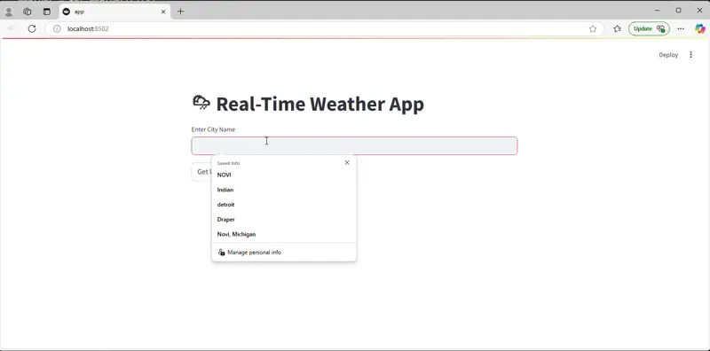

# 🌦 Real-Time Weather App

A Python-based app that fetches real-time weather data using the OpenWeatherMap API.

## 🚀 Features
- Fetches live weather data for any city
- Displays temperature, humidity, and weather conditions
- Simple **CLI-based** and **Streamlit Web UI**

---

## 📦 Installation
### **1️⃣ Clone the Repository**
```bash
git clone https://github.com/nagakirankasi/Weather-App.git
cd Weather-App
```

### **2️⃣ Install Dependencies**
Ensure Python 3.8+ is installed, then run:
```bash
pip install -r requirements.txt
```
**Example `requirements.txt`**:
```
requests
streamlit
flask
```

---

## 🔑 API Setup
Sign up at [OpenWeatherMap](https://openweathermap.org/) and get a **free API key**.
Replace `your_api_key` in `weather.py` with your actual API key:
```python
API_KEY = "your_api_key"
```

---

## 🌐 Usage
### **1️⃣ CLI Mode**
Run the script in command line mode:
```bash
python weather.py
```
Enter the city name when prompted, and the weather details will be displayed.

### **2️⃣ Web UI (Streamlit)**
Launch the web interface:
```bash
streamlit run app.py
```
Use the input field to enter a city name and fetch weather data.

---

## 🧪 Running Tests
To ensure the weather API integration works correctly, run:
```bash
python -m unittest discover tests
```

---
## Short Demo


---


## 📢 Contributing
Feel free to fork this repository and submit **pull requests** to improve the project!

### 🔥 Future Enhancements
- Display **5-day weather forecast**
- Add **graphical weather trends**
- Support for **multiple weather APIs**

---

This project is designed to provide accurate and up-to-date weather information in a simple format. 🌍🌤 Let us know if you have suggestions for improvements! 🚀

